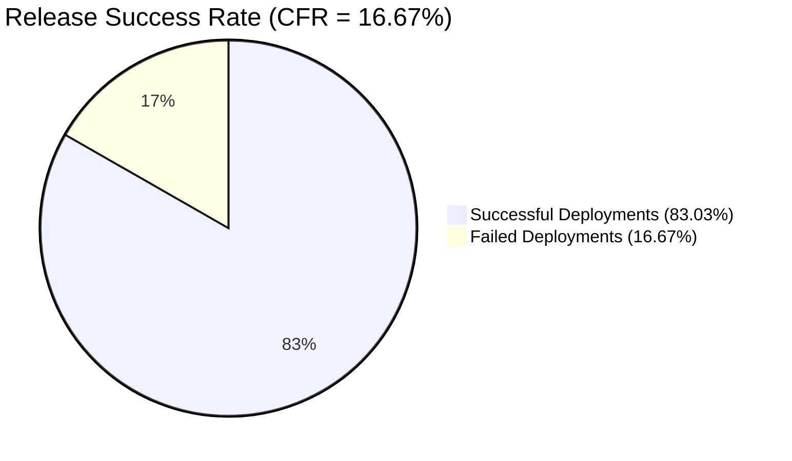
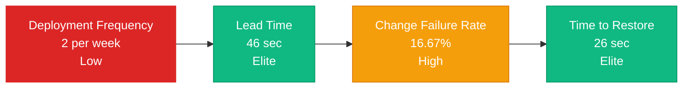

# DORA Metrics Report

| Metric | Formula | Your Result | Category* |
|---------|----------|:-----------:|------------|
| Deployment Frequency | #successful deployments / week | 2 deploys/week | **Low** |
| Lead Time for Changes | mean(merge → deploy time) | 46s (0.8min) | **Elite** |
| Change Failure Rate | failed / total deployments × 100 % | 16.67% | **High** |
| Time to Restore | mean(time to fix failed build) | 26s (0.4min) | **Elite** |

### Release Success Rate (Pie Chart)

