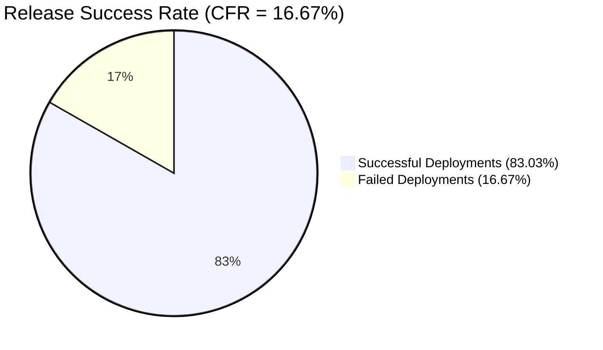
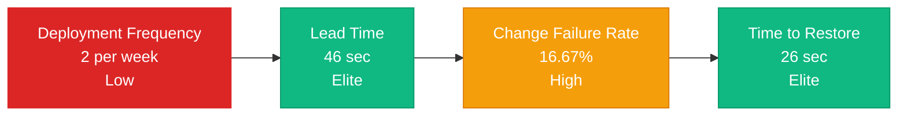

# DORA Metrics Report

| Metric | Formula | Your Result | Category* |
|---------|----------|:-----------:|------------|
| Deployment Frequency | #successful deployments / week | 2 deploys/week | **Low** |
| Lead Time for Changes | mean(merge → deploy time) | 46s (0.8min) | **Elite** |
| Change Failure Rate | failed / total deployments × 100 % | 16.67% | **High** |
| Time to Restore | mean(time to fix failed build) | 26s (0.4min) | **Elite** |

### Release Success Rate (Pie Chart)

## 🎯 Improvement Backlog

### Priority 1: CRITICAL - Test Stabilization (CFR ↓)

| Metric | Problem | Root Cause | Improvement Action | Expected Result |
|:-------|:--------|:-----------|:-------------------|:----------------|
| **Change Failure Rate** | 16.67% failures, 86% in "Run API Tests" | Flaky integration tests - non-deterministic behavior | 1. **Flaky test audit**: Analyze all API tests that fail unpredictably 2. **Stabilize mocks**: Review mocks/stubs, use test containers instead of mock services 3. **Intelligent retry strategy**: Add smart retries for network-dependent tests (without hiding real issues) 4. **Deterministic test data**: Use fixed test fixtures instead of random data 5. **Test isolation**: Ensure tests don't depend on execution order | CFR < 10% (goal: 5-8%) |
| **Change Failure Rate** | 2 failures in Deploy to EC2 | Infrastructure or configuration issues | 1. **Infrastructure as Code review**: Audit Terraform/Ansible scripts 2. **Staging environment**: Create full production replica for pre-deployment tests 3. **Health checks**: Add automated post-deployment verification (smoke tests) 4. **Deployment validation**: Verify environment state before and after deployment | 0 deployment failures |

**Why This Matters:**
Flaky tests undermine the entire CI/CD value proposition. When 1 in 6 deployments fails and the team can't trust test results, they naturally become conservative about deployments, creating a vicious cycle.

---

### Priority 2: HIGH - Increase Deployment Frequency (DF ↑)

| Metric | Problem | Root Cause | Improvement Action | Expected Result |
|:-------|:--------|:-----------|:-------------------|:----------------|
| **Deployment Frequency** | Only 2 deploys/week despite 46s Lead Time | **Cultural barriers**: Team doesn't trust frequent releases due to high CFR | 1. **After test stabilization**: Implement daily deployments to staging 2. **Feature flags**: Use feature toggles to control feature visibility 3. **Small batch sizes**: Encourage smaller PRs (< 200 LOC) 4. **Automated staging deploys**: Auto-deploy to staging after merge to main 5. **Release train**: Establish predictable daily deployment windows | 5-10 deploys/week (daily deploys) |
| **Deployment Frequency** | Fear of production deployments | Lack of safe rollback mechanisms | 1. **Blue-Green deployment**: Implement blue-green strategy for instant rollback 2. **Canary releases**: Progressive rollout to 10% → 50% → 100% of users 3. **Monitoring & Alerts**: Set up automated alerts on critical metrics (error rate, latency) 4. **Rollback playbook**: Document and test rollback procedures 5. **Deployment dashboard**: Real-time visibility into deployment status | Team confidence in releases |

**Why This Matters:**
Our problem isn't technical capability (Lead Time = 46s) but organizational trust. Frequent, small deployments reduce risk per release and create a virtuous cycle: more deployments → smaller changes → lower risk → even more deployments.

---

### Priority 3: MEDIUM - Process Optimization (maintain Elite metrics)

| Metric | Problem | Root Cause | Improvement Action | Expected Result |
|:-------|:--------|:-----------|:-------------------|:----------------|
| **Lead Time** | Elite level (46s) but high variance | Some builds take 81s, others 8s - inconsistent performance | 1. **Pipeline optimization**: Parallelize independent tests 2. **Caching strategy**: More efficient dependency caching (npm/maven cache) 3. **Selective testing**: Run only relevant tests for changed modules 4. **Build profiling**: Identify and optimize slow pipeline steps | Consistent Lead Time 30-50s |
| **Time to Restore** | Elite (26s) but based on many failures | 21 restoration events in analyzed period | 1. **Preventive measures**: Reduce need for restoration by improving CFR 2. **Automated rollback**: Auto-rollback when issues detected 3. **Post-mortem process**: Document each failure and root cause 4. **Incident tracking**: Create trend analysis of failure patterns | < 5 recovery events per month |

---

### Priority 4: LONG-TERM - Cultural Transformation

| Metric | Problem | Root Cause | Improvement Action | Expected Result |
|:-------|:--------|:-----------|:-------------------|:----------------|
| **All metrics** | Low trust in CI/CD process | Culture of "entire team waits for QA to deploy" | 1. **Trunk-Based Development**: Move from feature branches to trunk-based with short-lived branches 2. **"You build it, you run it"**: Developers responsible for monitoring their changes in production 3. **CI/CD training**: Train team on best practices and DORA research 4. **Metrics dashboard**: Visualize DORA metrics for entire team 5. **Blameless post-mortems**: Focus on system improvement, not individual blame | Culture of ownership & continuous improvement |
| **Team velocity** | Manual approval bottlenecks | Centralized release decision-making | 1. **Automated gates**: Replace manual approvals with automated quality gates 2. **Decentralized authority**: Empower teams to deploy within safety guardrails 3. **Release champions rotation**: Different team members lead releases weekly 4. **Deployment metrics**: Track who, when, what gets deployed | Faster decision-making |

**Why This Matters:**
Technical solutions alone won't fix organizational problems. True continuous delivery requires a shift from "deployment as special event" to "deployment as routine operation" - and that's fundamentally a cultural change.

---

## 📈 Metrics Targets

### Current State vs Target (3 months)

| Metric | Current | Target | DORA Category Goal |
|:-------|:--------|:-------|:-------------------|
| Deployment Frequency | 2/week | 1-2/day | **Low → High/Elite** |
| Lead Time | 46s | 30-45s | **Elite (maintained)** |
| Change Failure Rate | 16.67% | <10% | **High → Medium/Low** |
| Time to Restore | 26s | <1min | **Elite (maintained)** |

---

## 📊 What Pain Points Do These Metrics Reveal?

### 🔴 Deployment Frequency: 2 deploys/week (LOW)

**Team Pain:**
- **User frustration**: New features and bug fixes are delayed for weeks, users don't receive value in time
- **Developer context loss**: Large gaps between releases lead to accumulated changes, making it harder to understand the impact of each individual change
- **Gap between code and value**: Code is written, tested, but "stuck" waiting for release - the team works, but results don't reach users
- **Release anxiety**: Infrequent deployments = large changes = higher risk = more stress during releases

**Real Impact:**
With only 2 deployments per week, features written at the beginning of a sprint may only reach users at the end or even in the next sprint. This creates a backlog of "done but not delivered" work that frustrates both the team and stakeholders.

### 🟢 Lead Time: 46 seconds (ELITE)

**Positive:**
- **Fast feedback loop**: From commit to deployment in under a minute - the technical process is perfectly tuned
- **Efficient automation**: Our pipeline is optimized and doesn't create technical delays

### 🟠 Change Failure Rate: 16.67% (HIGH)

**Team Pain:**
- **Distrust in the release process**: Every 6th deployment fails - this creates nervousness before each release
- **Lost time on fixes**: Out of 100 runs, 21 failed (including 3 user-cancelled due to issues)
- **Firefighter syndrome**: Instead of building new features, the team spends ~17% of time fixing failures
- **Reputation damage**: Users may encounter unstable versions, damaging trust in the product

**Data Analysis:**
- 21 failed builds out of 100 runs
- Primary failure cause: "Run API Tests" (18 out of 21 cases)
- 2 failures in "Deploy to EC2"
- 3 manual cancellations due to detected issues

This is a classic case of flaky tests - unstable tests that create noise and reduce confidence in the entire CI/CD process.

### 🟢 Time to Restore: 26 seconds (ELITE)

**Positive:**
- **Quick response**: Team effectively fixes issues within half a minute
- **Well-established process**: Rollback and hotfix mechanisms work well

---
